# 【GKE】 アプリケーションレイヤでのシークレットの暗号化

## 解説
https://zenn.dev/articles/f42d6daa1e2688

## アプリケーションレイヤでのシークレットの暗号化とは？
- 公式ドキュメント
  - https://cloud.google.com/kubernetes-engine/docs/how-to/encrypting-secrets#console_1
- 概要
  - 以下の図がkubernetesの簡易的な構成図です
  - secretのデータは `etcd` に格納されています
  - Userが `kubectl get secret` のようなコマンドを実行すると、 `kube-api-server` がetcdからsecretのデータを取得し、復号化してユーザーに返却します。
- GKE はデフォルトで、シークレットなどの保存されている顧客コンテンツを暗号化してくれています
- アプリケーションレイヤでsecretを暗号化すると、機密データ（etcd に格納されている Secret など）に対するセキュリティをさらに強化できます
  - たとえば、攻撃者がetcdのオフラインコピーにアクセスした場合でもデータの内容を保護できるようになります
- CloudKMSで自分で鍵を作成し、その鍵を使用してsecretを暗号化してくれます



## セットアップ
- `Terraform v0.14.5`のインストール
  - https://releases.hashicorp.com/terraform/
- Google Cloud Platformのprojectを作成する
  - https://cloud.google.com/resource-manager/docs/creating-managing-projects
- GCP StorageのBucketを作成する
  - https://cloud.google.com/storage/docs/creating-buckets
- `gcloud CLI`のインストール（VMインスタンスにSSH接続したい場合）
  - https://cloud.google.com/sdk/gcloud

## リソースの作成
```
$ export GCP_PROJECT_ID="your-gcp-project-id"
$ export GCP_PROJECT_NUMBER="your-gcp-project-number"
$ export GCS_BUCKET_NAME="your-gcs-bucket-name"

$ bin/apply $GCP_PROJECT_ID $GCP_PROJECT_NUMBER $GCS_BUCKET_NAME
```

## リソースの削除
```
$ export GCP_PROJECT_ID="your-gcp-project-id"
$ export GCP_PROJECT_NUMBER="your-gcp-project-number"
$ export GCS_BUCKET_NAME="your-gcs-bucket-name"

$ bin/destroy $GCP_PROJECT_ID $GCP_PROJECT_NUMBER $GCS_BUCKET_NAME
```
